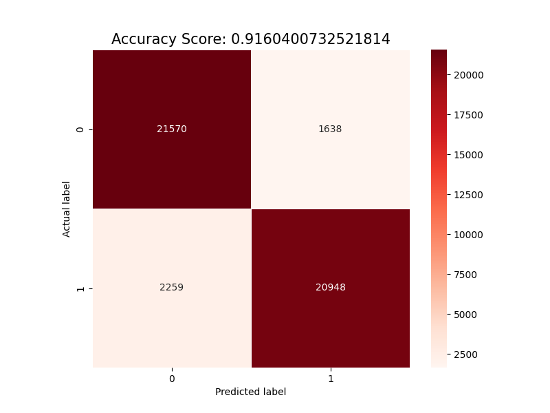

# Potential Suicidal Text Detection

## Introduction

The goal of this project is to build a system that can detect potential suicidal text from a given text. The system is built using a dataset of total around 200k text samples, 100k of which are suicidal and 100k of which are non-suicidal. The system are built using only machine learning techniques, no deep learning techniques are used, and the system is built using mostly NLTK and scikit-learn libraries.

## Dataset

The dataset used in this project is the [Suicide and Depression Detection](https://www.kaggle.com/datasets/nikhileswarkomati/suicide-watch) from [Kaggle](https://www.kaggle.com/cosmos98/twitter-and-reddit-sentimental-analysis-dataset). The dataset contains 100k suicidal text samples and 100k non-suicidal text samples, with each text already annotated. The dataset is split into 80% training set and 20% testing set. The amount of data available for this case is immense, and although it could be reduced to decrease complexity, all of the data was utilized as the machine learning model remained trainable and effective.

## Preprocessing

1. **Lowercasing**: The text data is converted to lowercase to ensure uniformity in the text.
2. **Punctuation Removal**: All punctuation marks are eliminated from the text to avoid noise and improve analysis accuracy.
3. **Stopword Removal**: Commonly occurring words, such as "the" and "is," which provide little semantic value, are removed from the text to focus on more meaningful content.
4. **Tokenization**: The text is split into individual tokens, such as words or phrases, to facilitate further analysis and feature extraction.
5. **Lemmatization**: Words are transformed into their base or dictionary form (lemmas) to reduce redundancy and enhance the quality of text representation.

## Feature Extraction

Once the text is preprocessed, it is converted into a numerical representation that can be used by the machine learning model. **TF-IDF** techniques is used to convert the text into a vector of numbers.

TF-IDF is a numerical statistic that is intended to reflect how important a word is to a document in a collection or corpus. The TF-IDF value increases proportionally to the number of times a word appears in the document and is offset by the number of documents in the corpus that contain the word, which helps to adjust for the fact that some words appear more frequently in general.

TF-IDF are believed to be a good choice for feature extraction as it is able to capture the importance of a word in a document, specifically in this case, the importance of a word in a suicidal text.

## Machine Learning Model

The machine learning model used in this project is a **LGBMClassifier** from the LightGBM library. LightGBM is a gradient boosting framework that uses tree-based learning algorithms. It is designed to be distributed and efficient with the following advantages:

- Faster training speed and higher efficiency.
- Lower memory usage.
- Better accuracy.
- Capable of handling large-scale data.

The main reason why LightGBM is chosen is because of its speed and efficiency. The dataset used in this project is very large, and the training time of other models is very long. LightGBM is able to reduce the training time significantly, and it is also able to achieve a very high accuracy.

## Results

The model is able to achieve:

| Accuracy | Precision | Recall | F1-Score |
| -------- | --------- | ------ | -------- |
| 91.6%    | 92%       | 92%    | 92%      |

Confusion Matrix:

From the results, it can be seen that the model is able to achieve a fairly high accuracy, precision, recall, and F1-score. This means that the model is able to detect suicidal text pretty well.

## Conclusion

The results show that the model is able to detect suicidal text pretty well. However, the model is not perfect, and there are still some errors, both false positives and false negatives. The model is also not able to detect suicidal text that are not in English. This is because the dataset used in this project is only in English. Notice that there are no hyperparameters tuning done in this project due to the time constraint and the large amount of data.

To overcome this, the model can be trained using a dataset that contains suicidal text in other languages. The model can also be further improved by tuning the hyperparameters, and by using deep learning techniques such as LSTM to improve the accuracy of the model.
